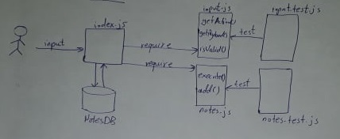
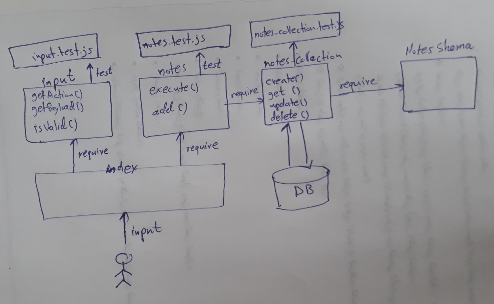

# notes
## How do I install the app or library?
npm install notes
## How do I test the app or library?
`filename -action note`  
action can be a or add for adding

## For Applications:
### How do I run the app?
node index.js -a good morning everybody

### How do I set up the app?

# Phase 3 Requirements
We will be extending the functionality of the notes application by adding a persistence layer to allow users to save notes to a database, organize them into categories, view, and delete them.    
`As a user, I want my notes to be saved in a database so that I can retrieve them later.`  
`As a user, I want to categorize my notes so that I can more easily find them.`  
`As a user, I want to be able to see a list of my notes so that I can manage them.`  
`As a user, I want to be able to delete a note`  

# Phase 4 Requirements
From a business/user perspective, the requirements remain unchanged from the previous lab.  
Users will be able to create and save notes to a database, organize them into categories, view, and delete them.

